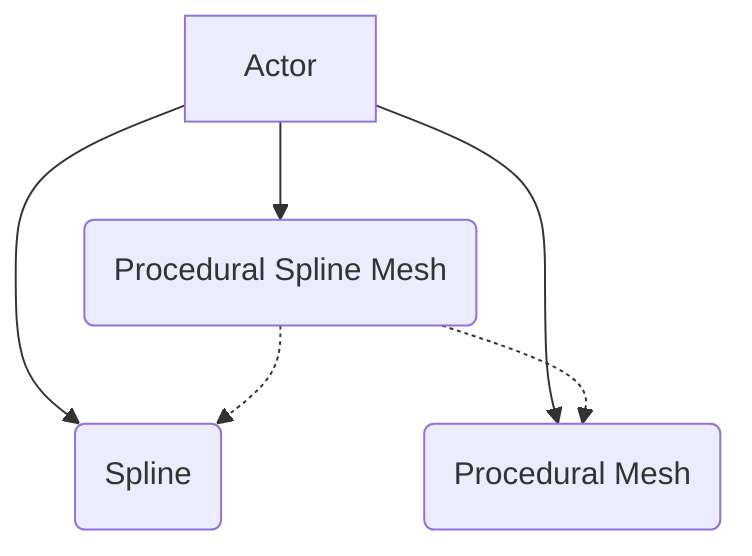

# SuperSplineMesh Plugin Documentation
**Accurate as of version v1.0.3**

## Basic Procedure
Using this plugin is very straightforward. It is presented as an actor component for you to use.

The first thing that you're going to want to do is create either a blueprint of the Procedural Spline Mesh Component or to create a new C++ class based on `UProceduralSplineMeshComponent`. 

To make a new blueprint based off of the component, do the following:

1. In the editor, right click in the Content Browser and select "Create Advanced Asset > Blueprint > Blueprint Class"

2. When the class picker comes up, select "Procedural Spline Mesh Component"

Next, you're going to want to add this component to an actor. You will want to add this component to an actor that has a **Procedural Mesh Component** and a **Spline Component**. To make it more clear, this is what we're trying to accomplish:

The actor should have a **Spline Component**, a **Procedural Mesh Component**, and a **Procedural Spline Mesh Component**.

In your actor's Construction Script (or in C++, its constructor), it should assign the "TargetSplineComponent" of the Procedural Spline Mesh Component to be your Spline Component, and the "TargetMeshComponent" of the Procedural Spline Mesh Component to be your Procedural Mesh Component. This establishes the link between your Procedural Spline Mesh Component and the components of your actor.

You'll now want to customize the properties of your Procedural Spline Mesh. For more information, take a look at the default properties of the mesh, or in the header file, where these are explicitly documented.

## Performance considerations
This component works by checking for differences in the spline every tick. Therefore, this component *needs* to tick, but not necessarily every frame.

There are a few things to consider when using this component that will help performance:

* **Don't add or remove points from the spline, instead use the Procedural Spline Mesh Component's functions.** The reason for this is pretty simple. The spline comparison function that occurs every tick isn't smart enough to check if a spline point was added or removed. If the number of spline points changes across a frame, *it will rebuild the entire mesh.* This might not be what you want. For example, if a new point was added to the end of the spline, you should logically only need to rebuild the last couple of points in the mesh.

* **Don't rebuild navigation and/or collision unless you need to.** This can actually have pretty large performance implications. (Note that in order for your navigation to work properly with this component, you'll need to configure your project to use Dynamic navigation, instead of the default Static navigation)
